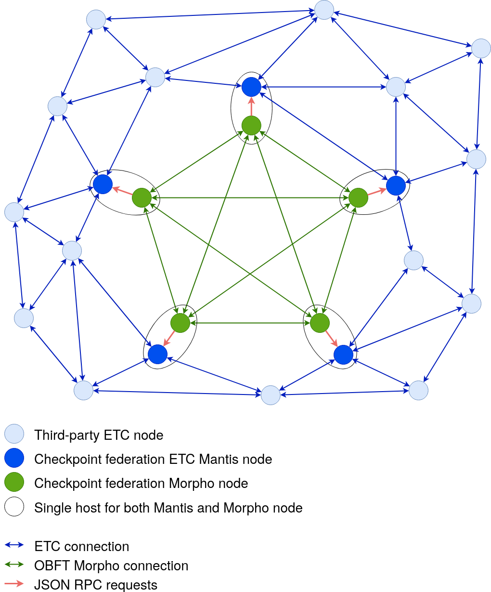

# Morpho Introduction

This document explains what Morpho is and how it can be used.

Fundamentally, Morpho monitors a value on each node in a distributed network and informs all nodes when they all agree on the same value. The implementation for this uses [OBFT](https://iohk.io/en/research/library/papers/ouroboros-bfta-simple-byzantine-fault-tolerant-consensus-protocol/), which provides resilience against a limited number of byzantine nodes. The network requires a fixed number of nodes, with each node knowing and trusting the public key of every other node in the network.

The primary intended use case is to secure proof-of-work (PoW) blockchains against 51% attacks with checkpointing, as described in [this paper](https://iohk.io/en/research/library/papers/securing-proof-of-work-ledgers-via-checkpointing/). More specifically to secure the ETC chain, as proposed in [ECIP1097](https://ecips.ethereumclassic.org/ECIPs/ecip-1097), whose description of a checkpointing federation Morpho is based on. While the implementation has specifics to this use case, there is very little preventing it to be more generic.

## Checkpointing and 51% attacks

51% attacks are possible when an adversary has more than half of the hashing power in the entire network, meaning they can produce blocks faster than all other miners combined. Over time this allows them to create a forking chain in private that is arbitrarily longer than the longest public chain. At any point, the attacker can then disclose their private chain to the public, at which point everybody will switch to the attacker's chain since it's longer. This is a problem because the attacker can choose which transactions are included in their chain. As an example, double spending is possible by not including a transaction that has already been considered confirmed in the public chain in their private chain.

An important aspect to consider is that 51% attacks become easier with lower mining participation since an attacker only needs more mining power than the entirety of the lawful miners. New chains or chains that are being migrated away from are therefore especially at risk.

Checkpointing is a proposed mechanism to solve this problem, securing a proof-of-work chain against 51% attacks, even with low mining participation. The main idea is to use a small number of trusted community members, a checkpointing federation, to regularly insert _checkpoints_ into the chain. Checkpoints are special non-proof-of-work blocks that _cannot_ be reverted, essentially confirming all transactions in preceding blocks. Instead of always preferring the longest chain, network nodes should then always adopt the chain with the latest checkpoint. In order to ensure that checkpoint blocks can only be created by the checkpointing federation, the blocks include a list of member signatures signing the preceding block hash. The honest nodes will have to be aware of each member's public key in order to verify such blocks. For more details, see especially section 3 of [the checkpointing paper](https://iohk.io/en/research/library/papers/securing-proof-of-work-ledgers-via-checkpointing/), or [the video discussing it](https://www.youtube.com/watch?v=aasUIB1W81E).

Morpho implements such a checkpointing federation, based on [OBFT](https://iohk.io/en/research/library/papers/ouroboros-bfta-simple-byzantine-fault-tolerant-consensus-protocol/) to provide consensus and byzantine fault tolerance among the federation members. It is built to interact with [Mantis](https://github.com/input-output-hk/mantis), an Ethereum Classic client that implements support for checkpoint blocks. This scheme has been proposed in [ECIP 1097](https://ecips.ethereumclassic.org/ECIPs/ecip-1097), which has been previously [discussed](https://www.youtube.com/watch?v=dentctKr880), and [demonstrated](https://www.youtube.com/watch?v=1JeL4pAjmXM). For more information, see [the formal Morpho specification](https://github.com/input-output-hk/OBFT-Checkpointing-Specification/blob/master/formal-spec/formal-spec.pdf).

## Topology

The checkpointing federation consists of a fixed number of Morpho nodes (configured with [`NumCoreNodes`](../references/configuration.md#numcorenodes)), each of which is run by a trusted party. These Morpho nodes are connected via TCP, striving for a fully connected network, meaning every node has a direct connection to every other node. The connections for this are handled by the [OBFT library](https://github.com/input-output-hk/ouroboros-network). The Morpho topology is specified with the file passed in [`TopologyFile`](../references/configuration.md#topologyfile), whose format is documented in the [topology page](../references/topology.md).

In addition to the Morpho nodes, each host of the federation also runs a non-mining [Mantis](https://github.com/input-output-hk/mantis) node. This node allows the checkpointing federation to interact with the ETC network.

For Morpho to know which proof-of-work blocks it can attempt to checkpoint and to publish the created checkpoints, it issues [JSON RPC](https://www.jsonrpc.org/) requests to its corresponding Mantis node. These connections are local to the federation host and therefore not exposed to the internet. This RPC interface is documented in the [RPC reference page](../references/rpc.md).

Here is a diagram of how such a topology looks. It consists of 5 Morpho nodes (green), fully connected with each other, each of which can issue JSON RPC requests to a Mantis node on the same host (red). Meanwhile, the Mantis nodes are connected to the ETC network (blue). The ETC network provides the federation with proof-of-work blocks to checkpoint, and receives checkpoints from the federation in return.

