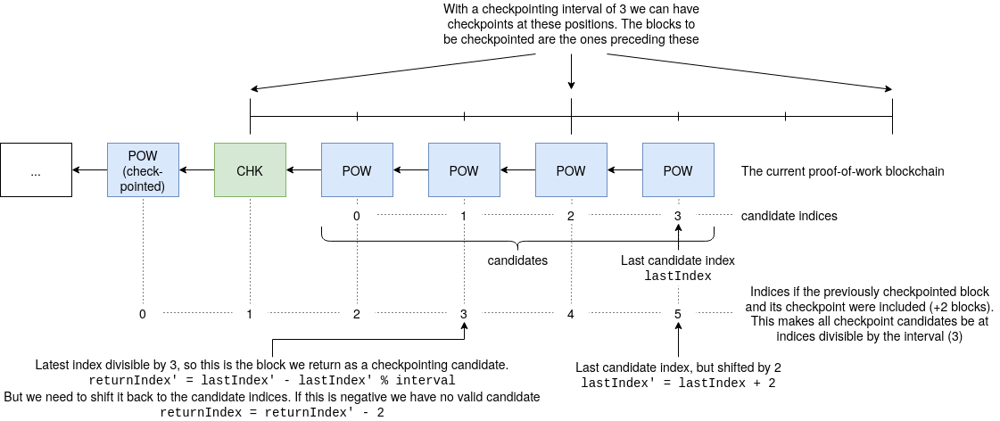

# JSON RPC specification

Morpho only interacts with the outside world by making [JSON RPC](https://www.jsonrpc.org/specification) requests to the server configured with [`PoWNodeRpcUrl`](configuration.md#pownoderpcurl). The server is assumed to participate in a proof-of-work blockchain, with the ability to query the chain and send new blocks. The following sections describe all methods that Morpho issues requests for, along with their parameters, result types and expected semantics. Morpho's client-side specification of this interface is defined in [JsonRpcProtocol.hs](../../morpho-checkpoint-node/src/Morpho/RPC/JsonRpcProtocol.hs). A mostly working server-side implementation of this specification can be found in Mantis, see [CheckpointingService.scala](https://github.com/input-output-hk/mantis/blob/25c3966d3500f3f362d5cc0b1c90ea36a7dc2279/src/main/scala/io/iohk/ethereum/jsonrpc/CheckpointingService.scala).

## Method `checkpointing_getLatestBlock`

#### Parameters (list)
0. (required, number): The checkpointing interval, as configured with [`CheckpointInterval`](configuration.md#checkpointinterval).
1. (required, null or string): The previously checkpointed block hash, or `null` if it doesn't exist.

#### Result (object)
- `block` (optional, object): The candidate block for the next checkpoint, or `null` if no candidate available.
  - `number` (required, number): The block number
  - `hash` (required, string): The block hash

#### Semantics

Let `interval` be the first parameter. Let `previousHash` be the second parameter.

This call should ensure that the latest checkpoint in the proof-of-work chain matches `previousHash`, and if so, return the latest candidate for the next checkpoint after that. The returned checkpoint candidate has to have a block distance divisible by `interval`. In case this can't be met, return an empty object. This can be implemented as follows:

- If `interval` is less than 2, return an empty object from the RPC call.
  Explanation: If we had a checkpoint distance of 1, we would not leave any room for proof-of-work blocks in-between, which would defeat the main motivation for checkpointing: To checkpoint proof-of-work blocks
- Ensure that the hash of the most recently checkpointed proof-of-work block in the proof-of-work chain matches `previousHash`. If it doesn't, return an empty object as the result of the call.
  Explanation: This ensures that this node can't issue votes that could fork the proof-of-work chain with conflicting checkpoints, which could happen if this node hasn't received the most recent checkpoint yet.
- Otherwise, let `candidates` be the list of proof-of-work blocks that follow `previousHash` (or the genesis block if `previousHash` is `null`).
  Explanation: This also ensures that this node can't issue votes that could fork the proof-of-work chain by signing blocks before the latest checkpoint
- Let `lastIndex'` be `length(candidates) + 1`.
  Explanation: This is the last index of the candidate list, but shifted by 2 to include the previously checkpointed block and its checkpoint
- Let `resultIndex` be `lastIndex' - lastIndex' % interval - 2`.
  Explanation: This is the latest block with a distance divisible by `interval` to the previously checkpointed block, but shifted back to not include the 2 additional blocks before the candidates.
- If `resultIndex` is negative, return an empty object from the RPC call.
- Otherwise return element at index `resultIndex` of `candidates`

Here is an explanatory diagram for this the index calculations of this implementation for an interval of 3:


An implementation of this in Haskell can be found [here](https://github.com/input-output-hk/ECIP-Checkpointing/blob/7f1e4f5b6d16e721d9bcad07fc528f83f97191a4/morpho-checkpoint-node/tests/Test/Morpho/MockRpc.hs#L221-L247).

### Examples

Expand to see examples:

<details>

#### Request (no previous checkpoint)
```json
{
  "jsonrpc": "2.0",
  "params": [
    4,
    null
  ],
  "method": "checkpointing_getLatestBlock",
  "id": 1
}
```

#### Request (with previous checkpoint)
```json
{
  "jsonrpc": "2.0",
  "params": [
    4,
    "0cd2db07b0853182947cd6b391ad697ab4a0125b6c4230d56c38bbefb9772d3e"
  ],
  "method": "checkpointing_getLatestBlock",
  "id": 1
}
```

#### Response (no checkpoint candidate)
```json
{
  "jsonrpc": "2.0",
  "result": {},
  "id": 1
}
```

#### Response (with checkpoint candidate)
```json
{
  "jsonrpc": "2.0",
  "result": {
    "block": {
      "hash": "0x0cd2db07b0853182947cd6b391ad697ab4a0125b6c4230d56c38bbefb9772d3e",
      "number": 8300
    }
  },
  "id": 1
}
```

</details>

## Method `checkpointing_pushCheckpoint`

#### Parameters (list)
0. (required, string): The block hash that is checkpointed
1. (required, list of strings): List of ECDSA signatures over the block hash, signed by different Morpho nodes. The number of signatures will always be equal to [`RequiredMajority`](configuration.md#requiredmajority).

##### ECDSA signature format

As explained in the [crypto document](../explanations/crypto.md#vote-signing), vote signatures consist of values `r`, `s` and `v = 27|28`, where `r` and `s` are each 256 bits or 32 bytes wide. In the RPC interface, such a signature is encoded by concatenating the _hexadecimal_ encoding of `r`, `s`, and `v`, where `v` is encoded as a single byte. This means a signature string consists of 130 hexadecimal characters, each pair of which encoding 8 bits / 1 byte, resulting in a hex character count composition of 64|64|2 for `r`|`s`|`v`.

#### Result (boolean)
`true` or `false`, ignored.

#### Semantics

Let `checkpointedHash` be the first parameter. Let `signatures` be the second parameter.

This method signals to the server that the block with hash `checkpointedHash` could successfully be checkpointed by a majority of Morpho nodes, whose signatures over the hash are passed with `signatures`. The server is then expected to forge a non-proof-of-work checkpoint block that includes the signatures as extra data, and whose direct parent is the block with hash `checkpointedHash`. Assuming the chain with the new checkpoint is now the chain with the most recent checkpoint, all other chains with older checkpoints and potentially newer proof-of-work blocks should be discarded in favor of the new chain.

The return value has historically always been `true`, and is ignored by Morpho.

### Example

Expand to see examples:

<details>

#### Request
```json
{
  "jsonrpc": "2.0",
  "params": [
    "0cd2db07b0853182947cd6b391ad697ab4a0125b6c4230d56c38bbefb9772d3e",
    [
      "a6903ced61e377a9e997cf3de9bfab5535210ab480ab6232522acf6511e0d5be78e794266441e27af9fd6ceca5b65a57a8e877357aa4bccc538d31d801cee89b1c",
      "84db4bcee868cc401c423b0aaa5019a3eb2d4253344ebf8dcf96e5be0c8a79420a656b51dd741e4f562bddbe2213cbd3aaf38bc320ac36d749423cbe8515ea0e1c",
      "6e812a276d46e2c3807eb8fe76b8e59cd9c9763e5eed24e5f89785e7d2299cc76e591813fa49c9293e826d3ba8044836171373b902f2ea02727add85bb4dccaf1b"
    ]
  ],
  "method": "checkpointing_pushCheckpoint",
  "id": 1
}
```

#### Response
```json
{
  "jsonrpc": "2.0",
  "result": true,
  "id": 1
}
```

</details>
